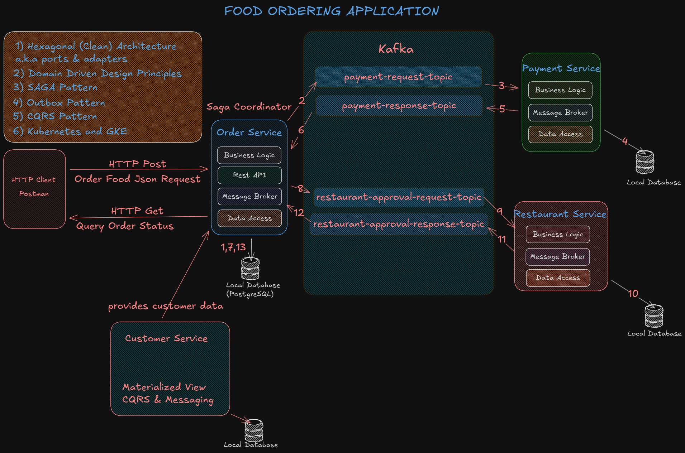
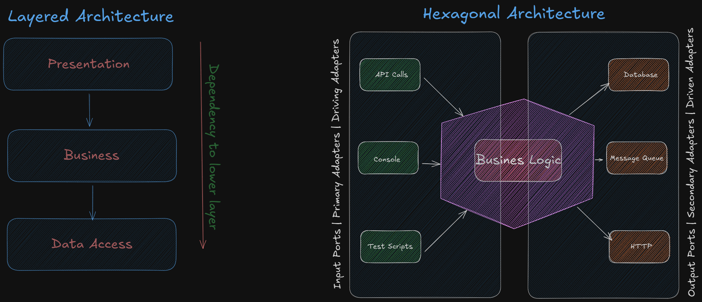
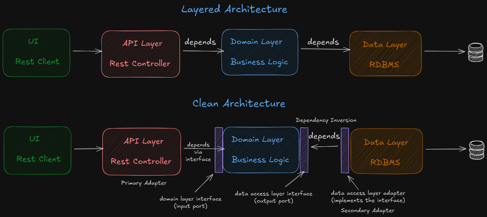

# Food-Ordering-Application
A scalable Spring Boot based food ordering service implementing DDD, Clean Architecture, SAGA, CQRS, Outbox, and Kafka.

**Hexagonal Architecture:** Hexagonal Architecture, also known as the Ports and Adapters pattern, is a software design approach that separates the core business logic from external systems such as databases, APIs, and user interfaces.

The core domain sits in the center and communicates with the outside world through ports (interfaces) and adapters (implementations). This allows the application to be easily tested, replaced, or extended without affecting the business logic. It improves maintainability, flexibility, and independence from infrastructure details.

Clean Architecture is used with Hexagonal Architecture interchangebly. Comparison of clean and layered architecture is below:

## 1. Order Service

Order service is designed by tactical domain driven development. Aggregates, value objects and event and the hierarchy is depicted in the figure:

